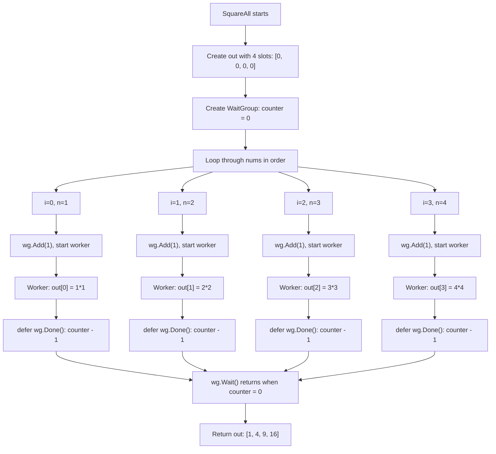

# `SquareAll` execution flow

Example input: `nums := []int{1, 2, 3, 4}`



## What happens in order?

1. **Sequential setup:** `SquareAll` allocates the output slice and starts its loop. The loop visits each input in order.
2. **Launch workers:** For each number, `wg.Add(1)` increments the WaitGroup counter, then `go` starts a worker with that item's index and value.
3. **Concurrent work:** The workers calculate and write results. Their completion order can differ from the input order; each writes to its own output index.
4. **Wait at the barrier:** Once the loop has started all workers, `wg.Wait()` blocks until all workers have called `Done`.
5. **Return:** Only after the counter reaches zero does the function return the completed output slice.

> **Important:** “Concurrent” means the workers can make progress independently and their execution may overlap; it does not guarantee that they all run at the exact same instant. The output order is preserved by writing each answer to `out[index]`, not by controlling which worker finishes first.

## Simplified timeline

```text
SquareAll (main goroutine): allocate out
  loop: Add(1) -> launch worker 0
       Add(1) -> launch worker 1
       Add(1) -> launch worker 2
       Add(1) -> launch worker 3
  Wait() -----------------------------------------------+
                                                       |
Worker 0: calculate 1*1 -> write out[0] -> Done() -----|
Worker 1: calculate 2*2 -> write out[1] -> Done() -----|-- counter is 0
Worker 2: calculate 3*3 -> write out[2] -> Done() -----|   Wait returns
Worker 3: calculate 4*4 -> write out[3] -> Done() -----+   return [1,4,9,16]
```

The worker lines are shown separately to illustrate parallel work. The loop
launches workers one by one, but after each launch the worker can run while
the loop continues launching the others.
